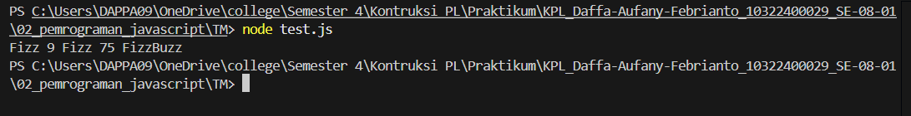

# Tugas Mandiri 02: Pemrograman JavaScript

*Nama : Daffa Aufany Febrianto*
*Nim  : 103122400029*
*Kelas: SE-08-01*

**Soal**

Buatlah sebuah fungsi bernama fizzBuzz yang menerima input larik (array) dan mengembalikan deretan bilangan dan "Fizz" untuk kelipatan 2, "Buzz" untuk kelipatan 7, dan "FizzBuzz" untuk kelipatan 14. Beri nama berkas program sebagai tm.js dan taruh di direktori TM.

**Kode sumber**

Tersedia di [test.js](./test.js)

**Output**

**Deskripsi Program**

Program ini berisi fungsi fizzBuzz yang menerima sebuah array berisi beberapa bilangan sebagai input yaitu [8, 9, 32, 75, 84] . Program akan memeriksa setiap bilangan dalam array menggunakan perulangan => `for (let i = 0; i < arr.length; i++)`. Jika bilangan input merupakan kelipatan 2 => `else if (arr[i] % 2 === 0) { hasil += "Fizz";}` , maka akan diganti dengan teks `"Fizz"`. Jika bilangan merupakan kelipatan 7 => `else if (arr[i] % 7 === 0) {hasil += "Buzz";}` , maka akan diganti dengan `"Buzz"`. Jika bilangan merupakan kelipatan 14 => `if (arr[i] % 14 === 0) { hasil += "FizzBuzz";}` , maka akan diganti dengan `"FizzBuzz"`. Jika tidak pada input tidak memenuhi ketiga kondisi tersebut, maka program akan menampilkan angka aslinya => `9,75` . Outputnya akan digabung menjadi satu string yang dipisahkan oleh spasi dan dikembalikan sebagai output => `Fizz 9 Fizz 75 FizzBuzz` .

