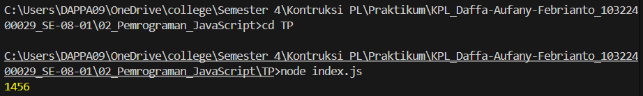

# Tugas Pendahuluan 02: Pemrograman JavaScript
**Soal**

Kamu sudah menulis fungsi mulOfArray. Ujilah dengan input [2, 0, 26, 28, -2], dengan output yang seharusnya adalah 1456. Jika kamu menemukan bahwa hasilnya berbeda, bisakah kamu memperbaikinya? Jika kamu menemukan bahwa hasilnya sama, bisakah kamu menjelaskan mengapa demikian?

**Kode sumber**

Tersedia di [index.js](./index.js)

**Output**

**Deskripsi Program**

untuk tugas ini agar pada output hasil arr1 dari 0 menjadi 1456 mengubah kondisi yang asalnya >= 0 (if (arr[i] >= 0) menjadi >0 (if (arr[i] > 0), sehingga membuat bilangan arr1 mengalikan semua bilangan array yang ada harus lebih dari 0 jika kurang maka akan diabaikan dan akan mendapatkan hasil : 2 x 26 x 28 = 1456

