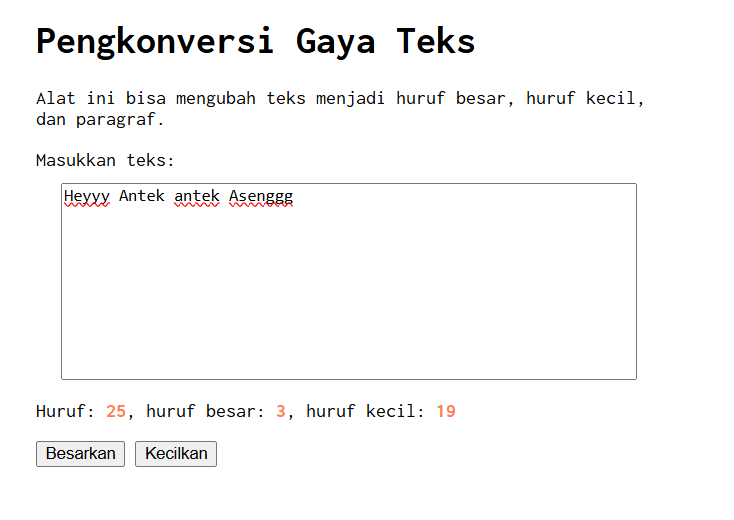
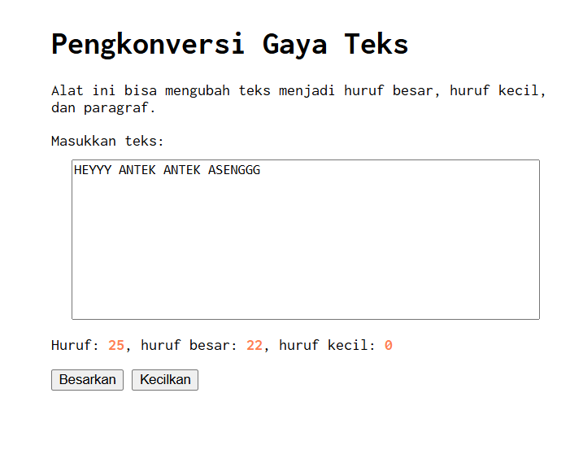
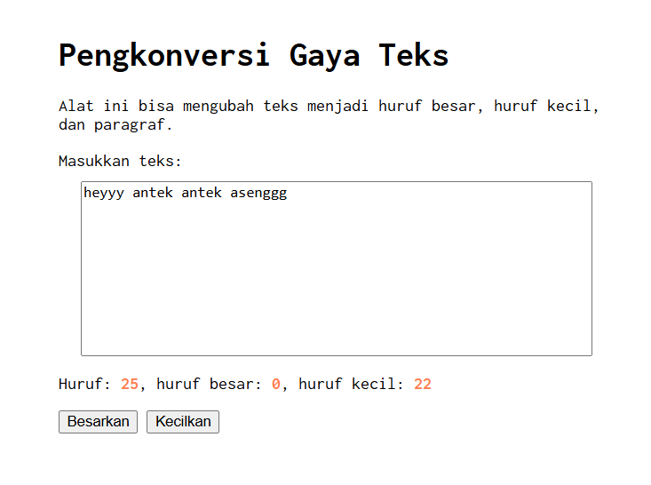

# Tugas Mandiri 03 : GUI dengan HTML dan CSS 

**Nama:** Daffa Aufany Febrianto    
**NIM:** 103122400029    
**Kelas:** SE-08-01  

## Tugas

Setelah kamu menyelesaikan tugas pendahuluan (bisa buka di atas), terapkanlah fungsi untuk (1) menghitung huruf kecil yang disediakan di #hk, (2) mengubah huruf kecil ke huruf besar ketika pengguna menekan tombol #huruf-besar, dan (3) mengubah huruf besar ke huruf kecil ketika pengguna menekan tombol #huruf-kecil.

## Program/Kode

Tersedia di [index.html](./index.html).
Tersedia di [style.css](./style.css).
Tersedia di [script.js](./script.js).

## Output





## Deskripsi

Program JavaScript ini berfungsi untuk mengelola teks yang dimasukkan pengguna pada textarea yang sudah diberikan, yaitu dengan menghitung jumlah karakter, jumlah huruf besar, jumlah huruf kecil, serta mengubah teks menjadi huruf besar atau huruf kecil melalui tombol yang tersedia.
dengan code -> 
```javascript
editorElement.addEventListener("input", (event) => {
    const text = event.target.value;

    charCountElement.textContent = text.length;

    let upper = 0;
    let lower = 0;

    for (let char of text) {
        if (char >= 'A' && char <= 'Z') {
            upper++;
        } else if (char >= 'a' && char <= 'z') {
            lower++;
        }
    }
});
```  
untuk menampilkan/Menghitung jumlah karakter menggunakan text.length dan juga Melakukan perulangan (for) untuk mengecek setiap karakter.

dan untuk membesarkan/mengecilkan huruf dengan menggunakan syntak ->

```javascript
btnUpper.addEventListener("click", () => {
    const text = editorElement.value;
    editorElement.value = text.toUpperCase();
    editorElement.dispatchEvent(new Event("input"));
});

btnLower.addEventListener("click", () => {
    const text = editorElement.value;
    editorElement.value = text.toLowerCase();
    editorElement.dispatchEvent(new Event("input"));
});

