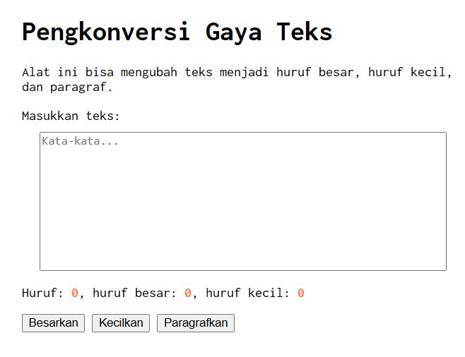

# Tugas Pendahuluan 03: GUI dengan HTML dan CSS

**Nama:** Daffa Aufany Febrianto  
**NIM:** 103122400029  
**Kelas:** SE-08-01  

## Tugas  
Buatlah tata letak laman yang kamu buat berada di tengah, dan juga ubah font-nya dengan Inconsolata dari Google Fonts.

## Kode Sumber
Tersedia di [index.html](./index.html)

## Output

## Deskripsi Program
Program ini berfungsi seperti mengecek huruf satu persatu apakah dia ada huruf besar atau kecil , dan juga untuk tampilanya dipindahkan menjadi berada di tengah halaman dengan menggunakan syntak baru di css.
