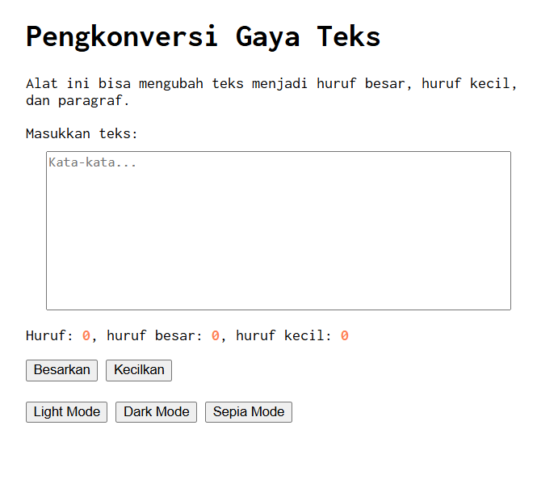
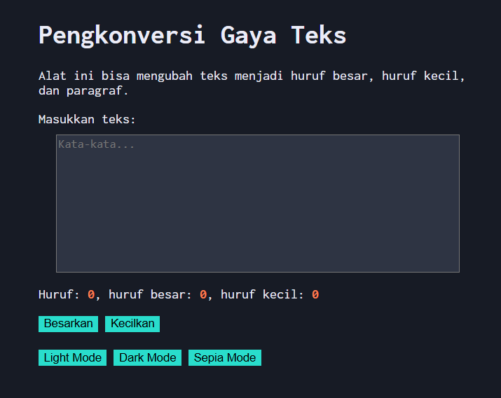
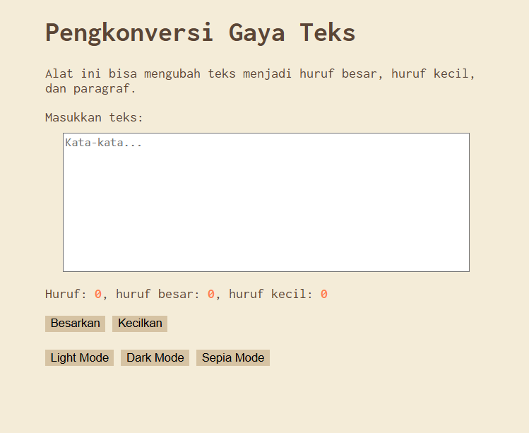

# Tugas Mandiri 04 : 04_Automata_dan_Table-Driven_Construction  

**Nama:** Daffa Aufany Febrianto    
**NIM:** 103122400029    
**Kelas:** SE-08-01  

## Tugas

Tambahkan mode sepia dengan ketentuan:

Elemen	Warna
Latar belakang	#F4ECD8
Warna teks	#5B4636
Biarkan form tetap warna putih.

Ketentuan lainnya:

1. Bagian mode-div harus menaungi tiga button: light, dark, dan sepia
2. Bisa berpindah state secara mulus: sepia menghasilkan sepia-mode, dark menghasilkan dark-mode, dan light menghasilkan light-mode

## Program/Kode

Tersedia di [index.html](./index.html).
Tersedia di [style.css](./style.css).
Tersedia di [script.js](./script.js).

## Output

## Deskripsi

pada program Tugas Mandiri 04 ini merupakan tambahan mode dari tp 04 sebelumnya dari yang asalnya hanya ada mode terang dan mode gelap sekarang Menambahkan mode baru yakni Sepia mode,yaitu warna backround akan berupa #F4ECD8 dan Teks berwarna #5B4636 serta menambahkan button Mode sepia di sebelah dark mode dan sedikit menambahkan transisi pada saat perpindahan mode agar sedikit mulus pada selector body (`transition: all 0.3s ease;`)

