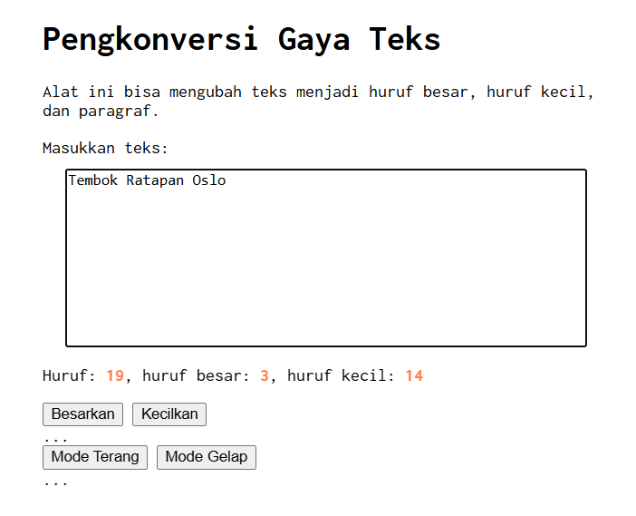
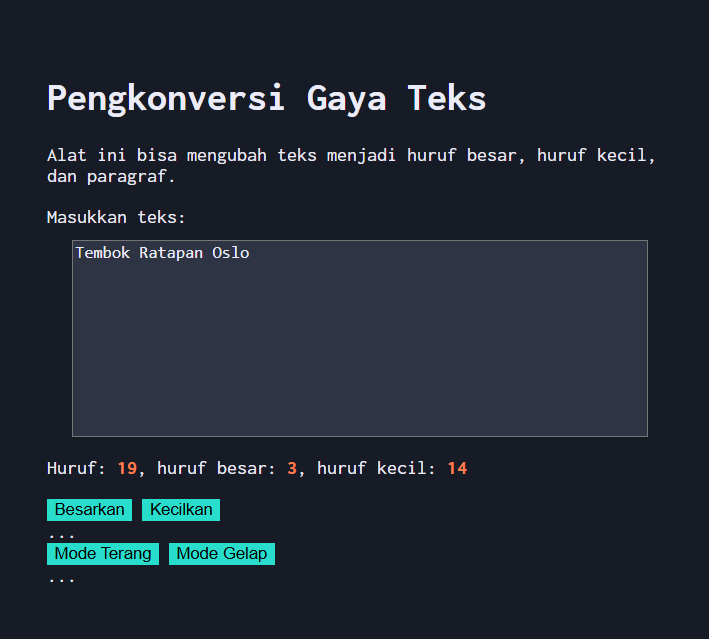

# Tugas Mandiri 03 : 04_Automata_dan_Table-Driven_Construction  

**Nama:** Daffa Aufany Febrianto    
**NIM:** 103122400029    
**Kelas:** SE-08-01  

## Tugas

Tambahkan mode gelap sekaligus untuk editor-kecil dan tombol-tombolnya. Ketentuan warna untuk latar belakang editor-kecil adalah #2e3443, sementara untuk tombol adalah #29ddcc. Teks untuk tombol tetap mengikuti warna teks sebelumnya.

## Program/Kode

Tersedia di [index.html](./index.html).
Tersedia di [style.css](./style.css).
Tersedia di [script.js](./script.js).

## Output




## Deskripsi

Program tp 4 kali ini menambahkan fitur mode terang dan mode gelap yang dimana ketika dipencet tombol terang akan menampilkan seluruh layar dan teks dengan kondisi terang dan jika memencet tombol mode gelap akan berubah untuk tampilanya menyesuaikan kenyamanan mata pada saat mode gelap dan untuk code menampilkan mode gelap ialah 

```CSS
.mode-gelap {
    background-color: #171b25;
    color: #EBECF7;
}

.mode-gelap .kotak-input{
    background-color: #2e3443;
    color: #EBECF7;
}

.mode-gelap button{
    background-color: #29ddcc;
    border: none;
}