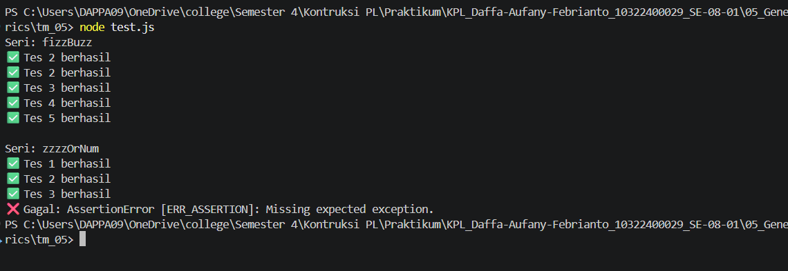

# Tugas Mandiri 05 : 05_Generics  

**Nama:** Daffa Aufany Febrianto    
**NIM:** 103122400029    
**Kelas:** SE-08-01  

## Tugas

Diberikan program index.js seperti ini:

```js
// Tambah JSDoc di sini
function zzzzOrNum(value) {
    // Ubah kode di sini
}

// Tambah JSDOC di sini
function fizzBuzz(sequence) {
    // Ubah kode di sini

    const newSequence = sequence.map((e) => zzzzOrNum(e));

    return newSequence;
}

module.exports = {
    fizzBuzz: fizzBuzz,
    zzzzOrNum: zzzzOrNum,
};
```

Aturan FizzBuzz kali ini adalah:

1. Fungsi fizzBuzz hanya menerima larik yang semua elemennya terdiri dari bilangan bulat dan mengeluarkan larik pula yang bisa jadi bercampur string dan bilangan
2. Fungsi zzzzOrNum hanya menerima sebuah data tunggal berupa bilangan bulat dan mengembalikan "Fizz", "FizzBuzz", "Buzz", atau bilanga bulat sesuai logikanya
3. Kedua fungsi harus ada dan harus disertai JSDoc sesuai tipe data yang disiratkan dari no. 1, no. 2, dan perilaku yang diharapkan di bawah
4. fizzBuzz harus menggunakan fungsi zzzzOrNum di dalamnya

## Program/Kode

Tersedia di [index.js](./index.js).
Tersedia di [test.js](./test.js).

## Output



## Deskripsi

pada Program TM 05 ini ialah implementasi FizzBuzz yang terdiri dari dua fungsi, yaitu zzzzOrNum untuk memproses satu angka dan fizzBuzz untuk memproses array angka. Program mengembalikan hasil sesuai aturan FizzBuzz (
    aturanya :  "Fizz" jika bilangan habis dibagi 3
                "Buzz" jika bilangan habis dibagi 5
                "FizzBuzz" jika bilangan habis dibagi 3 dan 5
                atau bilangan itu sendiri jika tidak memenuhi kondisi tersebut
) dan dilengkapi dengan validasi input serta pengujian menggunakan assert.

