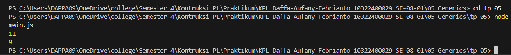

# Tugas Pendahuluan 05 : 05_Generics  

**Nama:** Daffa Aufany Febrianto    
**NIM:** 103122400029    
**Kelas:** SE-08-01  

## Tugas

Ini adalah kode yang mengurus jumlah semua karakter dan jumlah huruf:

```js
const str = "Bar bar";

let jumlahSemua = 0;
for (const c of str) { 
    jumlahSemua++; 
}
console.log(total);

let jumlahHuruf = 0;
for (const c of str) { 
    if (c === ' ') continue;
    jumlahHuruf++;
}
console.log(letters);
```
Bagaimana caramu hanya dengan satu fungsi generik bisa mengurus keduanya?

Agar fungsi yang kamu kerjakan benar atau tidak, berikut ini adalah kode tes yang bisa kamu tempelkan:

```js
const str = "Bar bar bar";
...
console.log(
   hitung(str, "semua") // Harusnya 11
);

console.log(
  hitung(str, "huruf") // Harusnya 9
);

hitung(str, "huruf"); // Tidak terjadi apa apa
```
## Program/Kode

Tersedia di [main.js](./main.js).

## Output



## Deskripsi

Program TP 05 kali ini yaitu menghitung jumlah karakter dalam sebuah string "Bar bar bar" menggunakan satu fungsi generik bernama hitung. Fungsi ini menerima dua parameter, yaitu string yang akan diproses dan tipe perhitungan ("semua" atau "huruf").

Jika tipe "semua" dipilih, maka fungsi akan menghitung seluruh karakter termasuk spasi. Sedangkan jika tipe "huruf" dipilih, maka fungsi hanya menghitung karakter selain spasi. Implementasi ini menggunakan satu perulangan (loop) sehingga lebih efisien dan menghindari duplikasi kode.

