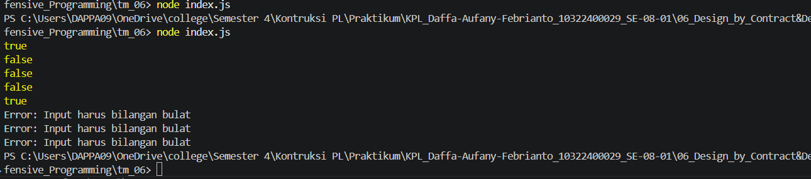

# Tugas Mandiri 06 : 06_Design_By_Contracts  

**Nama:** Daffa Aufany Febrianto    
**NIM:** 103122400029    
**Kelas:** SE-08-01  

## Tugas

Tugasmu adalah membuat fungsi yang menolak bilangan-bilangan kelipatan 3, 5, atau 15, menerima bilangan-bilangan bukan "fizz buzz", dan melempar yang bukan bilangan bulat.

```js
function is_not_fizzbuzz(number) {
  // TODO
}

console.log(is_not_fizzbuzz(1)) // true
console.log(is_not_fizzbuzz(3)) // false
console.log(is_not_fizzbuzz(5)) // false
console.log(is_not_fizzbuzz(30)) // false
console.log(is_not_fizzbuzz(7)) // true
console.log(is_not_fizzbuzz(null)) // Lempar TypeError
console.log(is_not_fizzbuzz(NaN)) // Lempar TypeError
console.log(is_not_fizzbuzz(Infinity)) // Lempar TypeError
```

## Program/Kode

Tersedia di [index.js](./index.js).

## Output



## Deskripsi

Program TM 06 kali ini ialah menyediakan Fungsi is_not_fizzbuzz digunakan untuk mengecek apakah suatu bilangan bukan termasuk bilangan FizzBuzz, yaitu bilangan yang tidak habis dibagi 3 atau 5.

Fungsi ini akan:
- Mengembalikan true jika bilangan bukan kelipatan 3 atau 5
- Mengembalikan false jika bilangan kelipatan 3, 5, atau 15
- Melempar TypeError jika input bukan bilangan bulat yang valid