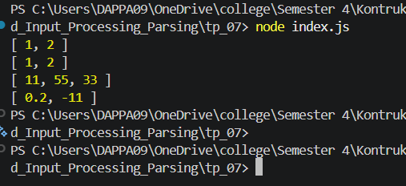

# Tugas pendahuluan 07 :  	07_Grammar-Based_Input_Processing_Parsing  

**Nama:** Daffa Aufany Febrianto    
**NIM:** 103122400029    
**Kelas:** SE-08-01  

## Tugas

Buatlah fungsi yang mengubah deretan angka bertipe string menjadi larik angka.

```js
function toNumberArray(number) {
  // TODO
}

console.log(toNumberArray("1, 2")) // [1, 2]
console.log(toNumberArray(["1", "2"])) // [1, 2]
console.log(toNumberArray(" 11,55,33   ")) // [11, 55, 33]
console.log(toNumberArray(["0.2", "-11", "abc23"]) // [0.2, -11]
```

## Program/Kode

Tersedia di [index.js](./index.js).

## Output



## Deskripsi

program TP 07 ini terdapat Fungsi toNumberArray yang mengimplementasikan proses parsing dengan memanfaatkan metode manipulasi string seperti split() untuk memecah data, trim() untuk membersihkan spasi, serta konversi tipe menggunakan Number() dan validasi dengan isNaN() untuk menghasilkan larik angka yang valid.