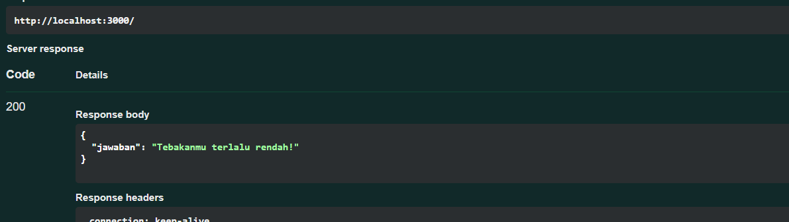
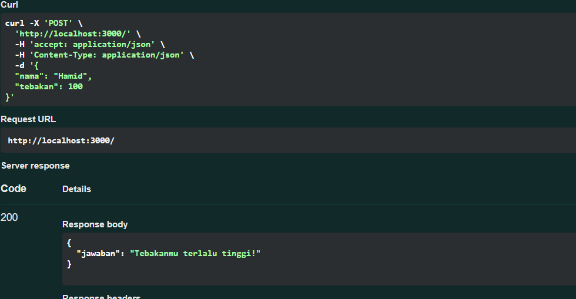
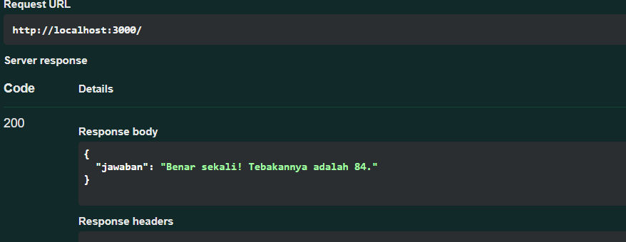

# Tugas Mandiri 09 :  	09 API Design dan Construction Using Swagger 

**Nama:** Daffa Aufany Febrianto    
**NIM:** 103122400029    
**Kelas:** SE-08-01  

## Tugas

Tugasmu adalah membuat API yang terdiri dari satu endpoint saja, yaitu POST /. Ketika kita melakkukan POST, formatnya adalah seperti di bawah ini.

```js
{
  "nama": "Hamid",
  "tebakan": 24
}

```
Jika tebakan benar.

```js
{
    "jawaban": "Benar sekali! Tebakannya adalah 24."
}

```
Jika tebakan terlalu tinggi.
```js
{
    "jawaban": "Tebakanmu terlalu tinggi!"
}

```
Jika tebakan terlalu rendah.
```js
{
    "jawaban": "Tebakanmu terlalu rendah!"
}
```

Beberapa aturan:

Angka acak yang dihasilkan harus tetap dan tidak boleh berubah setiap kali permintaan API dilakukan, tetapi boleh berubah setiap harinya atau dibuat tetap selamanya
Rentang harus di antara 1-100
Nama harus sensitif terhadap besar kecil huruf (mis. hamid dan Hamid akan menghasilkan angka acak yang berbeda)
Tidak menggunakan pustaka apapun, murni mengandalkan nama dan tebakan

## Program/Kode

Tersedia di [index.js](./index.js).


## Output





## Deskripsi

API ini adalah layanan sederhana dengan satu endpoint POST / yang menerima input nama dan tebakan angka. Sistem akan menghasilkan angka secara deterministik berdasarkan nama (selalu sama untuk nama yang sama), lalu membandingkannya dengan tebakan pengguna dan mengembalikan respon apakah tebakan benar, terlalu tinggi, atau terlalu rendah.