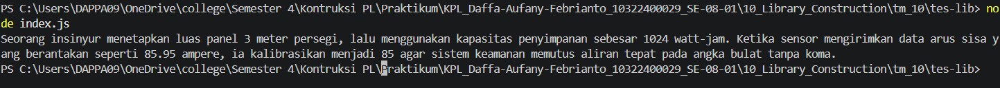

# Tugas Mandiri 10 :  	10 Library Construction 

**Nama:** Daffa Aufany Febrianto    
**NIM:** 103122400029    
**Kelas:** SE-08-01  

## Tugas

Buatkan pustaka yang rapi!

Pada tugas ini buatlah sebuah proyek baru bernama mtk-gampang. Struktur proyeknya wajib diatur seperti di bawah ini.


|   index.js
|   package.json
\---lib
        pangkat.js
        bulat.js
        kuadrat.js
Setiap berkas lib hanya memiliki satu fungsi saja.


pangkat.js berisi fungsi pangkat(x, y) yang mengembalikan nilai akhir dari x pangkat y.
bulat.js berisi fungsi bulat(x) yang mengubah bentuk bilangan non-bulat menjadi bulat (mis. -4.25 menjadi -4) .
kuadrat.js berisi fungsi kuadrat(x) yang mengembalikan nilai akar kuadrat 2 dari x.
Satu batasannya adalah fungsi-fungsi ini harus diakses dari index.js (sebagai nilai dari properti main), bukan dari lib masing-masing.

Jika sudah selesai, buatlah proyek baru lagi dan instal pustaka yang kamu buat secara lokal. Pada index.js-nya, gunakan kode ini untuk memastikan bahwa kamu berhasil melakukannya.

```js
import { kuadrat, pangkat, bulat } from "libr";

const narasi = `Seorang insinyur menetapkan luas panel ${bulat(kuadrat(12))} meter persegi, lalu menggunakan kapasitas penyimpanan sebesar ${pangkat(2, 10)} watt-jam. Ketika sensor mengirimkan data arus sisa yang berantakan seperti 85.95 ampere, ia kalibrasikan menjadi ${bulat(85.95)} agar sistem keamanan memutus aliran tepat pada angka bulat tanpa koma.`;

/**
 * Seorang insinyur menetapkan luas panel 3 meter persegi, lalu menggunakan kapasitas penyimpanan sebesar 1024 watt-jam. Ketika sensor mengirimkan data arus sisa yang berantakan seperti 85.95 ampere, ia kalibrasikan menjadi 85 agar sistem keamanan memutus aliran tepat pada angka bulat tanpa koma.
 * /

console.log(narasi);
```

## Program/Kode

Tersedia di folder [mtk_gampang](./mtk_gampang/index.js).
Tersedia di folder [tes-lib](./tes-lib/index.js).

## Output



## Deskripsi

pada tugas mandiri 10 ini membuat sebuah pustaka bernama mtk-gampang yang merupakan library matematika sederhana berbasis Node.js yang menyediakan fungsi dasar seperti perpangkatan, pembulatan bilangan, dan akar kuadrat. Library ini dirancang dengan struktur modular agar setiap fungsi dipisahkan ke dalam berkas tersendiri, namun tetap dapat diakses melalui satu entry point utama pada index.js