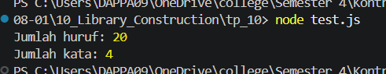

# Tugas pendahuluan 10 :  	10 Library Construction 

**Nama:** Daffa Aufany Febrianto    
**NIM:** 103122400029    
**Kelas:** SE-08-01  

## Tugas

Buatlah pustaka JavaScript yang menyediakan utilitas berupa dua fungsi yang menghitung jumlah huruf dan jumlah kata.

Kriteria:

Hanya alfabet A hingga Z yang dihitung (besar dan kecil)
Spasi tidak dihitung
Pustaka bisa diimpor

## Program/Kode

Tersedia di [index.js](./index.js).
Tersedia di [test.js](./test.js).

## Output

## Deskripsi

pada tugas pendahuluan 10 ini membuat sebuah library untuk menyediakan dua fungsi utilitas yaitu hitungHuruf dan hitungKata. Fungsi hitungHuruf digunakan untuk menghitung jumlah karakter alfabet (A-Z) dalam suatu teks dengan mengabaikan angka, simbol, dan spasi. Sedangkan fungsi hitungKata digunakan untuk menghitung jumlah kata yang valid berdasarkan pola huruf. Pustaka ini menggunakan sistem modul ESM sehingga dapat diimpor dan digunakan kembali pada aplikasi lain.