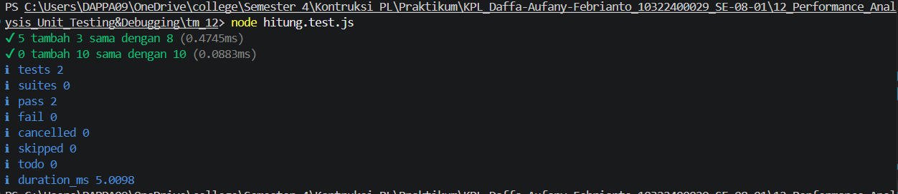

# Tugas pendahuluan 12 :  	Performance Analysis, Unit Testing, dan Debugging

**Nama:** Daffa Aufany Febrianto    
**NIM:** 103122400029    
**Kelas:** SE-08-01  

## Tugas

Fungsi di bawah ini melakukan penjumlaha pada penghitung (counter), yang sesederhana menambahk jumlah jika kamu menekan tombol.

hitung.js
```js
function tambahPengitung(terkini, jumlah) {
  terkini = terkini + jumlah;
  return terkini;
}
```
hitung.test.js
```js
import { test } from 'node:test';
import assert from 'node:assert';
import { tambahPengitung } from './hitung.js';

test('5 tambah 3 sama dengan 8', () => {
  assert.strictEqual(tambahPengitung(5, 3), 8);
});

test('0 tambah 10 sama dengan 10', () => {
  assert.strictEqual(tambahPengitung(0, 10), 10);
});
```
Bisakah kamu tunjukkan apakah kode sudah benar atau bagian mana yang perlu diperbaiki beserta alasannya?

## Program/Kode

Tersedia di [hitung.js](.hitung.js).
Tersedia di [hitung.test.js](.hitung.test.js).

## Output



## Deskripsi
untuk perbaikan fungsi tambahPengitung ditambahkan export agar dapat digunakan pada file test:
```js
export function tambahPengitung(terkini, jumlah) {
  return terkini + jumlah;
}
```

lalu program TM 12 ini digunakan untuk melakukan unit testing pada fungsi tambahPengitung. Fungsi tersebut bertugas menambahkan nilai counter saat ini dengan jumlah tertentu. Pengujian dilakukan menggunakan modul bawaan Node.js, yaitu node:test dan node:assert, sehingga tidak perlu menginstall library tambahan. Dari hasil pengujian, fungsi dinyatakan benar karena test 5 + 3 = 8 dan 0 + 10 = 10 berhasil dijalankan.
