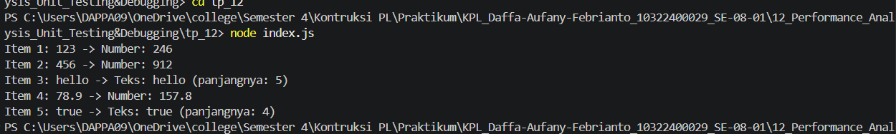

# Tugas pendahuluan 12 :  	Design Pattern Implementation

**Nama:** Daffa Aufany Febrianto    
**NIM:** 103122400029    
**Kelas:** SE-08-01  

## Tugas

Cobalah untuk menangkap kecacatan dalam kode ini

```js
function main() {
  const data = [
    "123",
    456,
    "hello",
    78.9,
    true,
  ];

  for (let i = 0; i < data.length; i++) {
    const result = processData(data[i]);
    console.log(`Item ${i + 1}: ${data[i]} -> ${result}`);
  }
}

function processData(data) {
  const str = data.toLowerCase();
  const num = parseInt(str);
  if (!isNaN(num) && str === String(num)) {
    return `Number: ${num * 2}`;
  }
  return `Teks: ${str} (panjangnya: ${str.length})`;
}

main();
```

## Program/Kode

Tersedia di [index.js](./index.js).

## Output



## Deskripsi

Tugas Pendahuluan 12 ini ialah program untuk memproses beberapa data dengan tipe yang berbeda, yaitu string, number, decimal, dan boolean. Pada kode awal terdapat kecacatan karena method toLowerCase() langsung digunakan pada semua data, padahal method tersebut hanya bisa digunakan pada string. Oleh karena itu, program diperbaiki dengan mengubah setiap data menjadi string terlebih dahulu menggunakan String(data), sehingga program dapat berjalan tanpa error. Selain itu, penggunaan Number() membuat program dapat mengenali angka bulat maupun angka desimal.